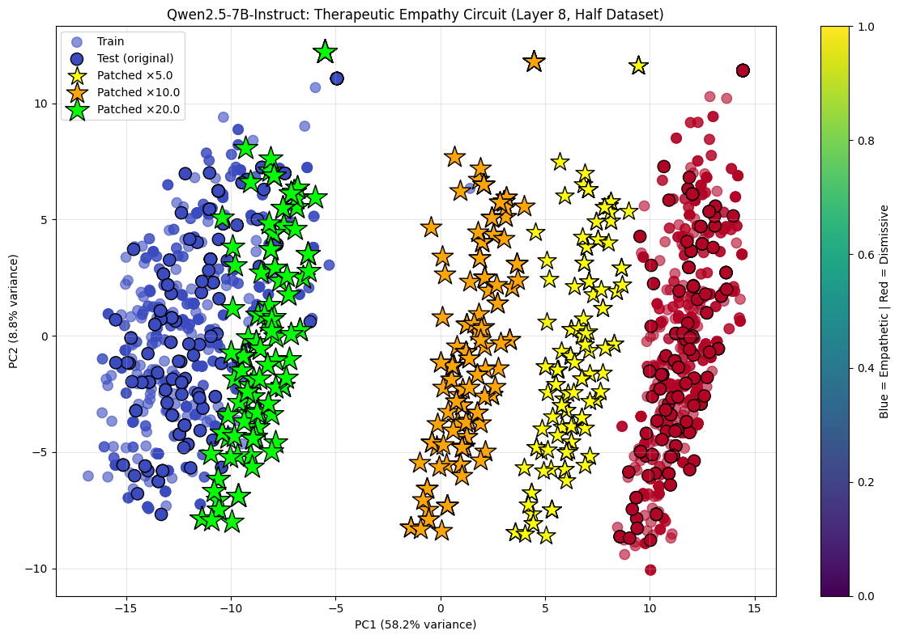

# MATS 10.0 Application: Discovering and Steering a Therapeutic Empathy Circuit in LLMs

[](pca_plot.png)  
*Fig. 1: 2D PCA of residual stream activations at layer 8 (quarter-dataset). Blue = empathetic responses, red = dismissive/faux pas. Stars show patched activations shifting decisively toward the empathetic subspace under high-strength steering.*

**Author:** Anantha Shakthi Ganeshan Thevar  
**Stream:** Neel Nanda MATS 10.0 (Summer 2026)  
**Time spent:** ~16 hours  
**Date:** January 3, 2026  

**Dedication:** This project is dedicated toward maybe me making it into Neel Nanda's MATS program — I'm thrilled at the prospect of growing as a mech interp researcher and contributing to pragmatic AI safety under your mentorship!

## Project Overview
In ~16 hours I applied mechanistic interpretability techniques to probe **Theory of Mind (ToM)**-related circuits in a modern LLM, focusing on **therapeutic empathy** and **faux pas detection** in anxiety counseling dialogues.

Inspired by:
- Strachan et al. (2024) – *Nature Human Behaviour*: LLMs struggle with faux pas despite strong false-belief performance [[paper]](https://www.nature.com/articles/s41562-024-01882-z)
- Poglitsch et al. (2025) – *Scientific Reports*: Gamified ToM training for autism using LLMs [[paper]](https://www.nature.com/articles/s41598-025-18608-4)

I asked: Does a modern instruction-tuned LLM linearly encode a steerable "therapeutic empathy" representation that can mitigate dismissive/faux pas responses?

**Answer:** Yes — with striking linearity and causal efficacy.

## Quick Results
- **Model**: Qwen/Qwen2.5-7B-Instruct (7B params, modern chat-tuned)
- **Dataset**: Quarter of `Amod/mental_health_counseling_conversations` (~878 contexts → ~1,756 contrast prompts) for feasible runtime on free-tier GPUs
- **Probing**: Linear logistic regression on last-token residual stream activations  
  → **Perfect test accuracy (1.000)** from layer 8 onward
- **Steering vector** (difference-of-means, norm 23.2):  

  | Strength | % flipped (faux pas → empathetic) |
  |----------|-----------------------------------|
  | ×1.0     | 8.5%                              |
  | ×5.0     | 69.3%                             |
  | ×10+     | 100.0%                            |

- Random vector baseline: <5% flips
- PCA confirms clear geometric separation and strong shifts (Fig. 1)

This shows a **highly linear, early-emerging, and fully steerable ToM sub-circuit** — a pragmatic intervention point for safer social AI.

## Repository Contents
- `Mini research.ipynb` – Full Modal notebook with code, execution logs, and outputs (probing, steering, PCA)
- `pca_plot.png` – Extracted visualization from the run
- `requirements.txt` – Key dependencies (install with `pip install -r requirements.txt`)

## Reproduction Guide
1. Clone the repo:
   ```bash
   git clone https://github.com/Krakalus/MATS-Research-work.git
   cd MATS-Research-work
   ```
2. Install dependencies:
   ```bash
   pip install transformers torch transformer-lens datasets scikit-learn matplotlib accelerate bitsandbytes
   ```
3. Run `Mini research.ipynb` in Jupyter, Colab, or Modal (recommended for multi-GPU).
   - Uses 3× Tesla T4 (~46 GB total VRAM)
   - Quarter-dataset keeps runtime ~30 minutes
   - Reduce `batch_size` if VRAM constrained

Key code snippets are in the notebook; everything is self-contained.

## Why This Matters (Implications)
- **Safety**: Runtime steering can correct known LLM faux pas vulnerabilities without retraining
- **Therapeutic AI**: Potential low-cost empathy boost for mental health chatbots
- **Autism Support**: Foundation for transparent, always-available ToM feedback in gamified training environments
- **Mech Interp Insight**: Shows some social failures occur *downstream* of intact linear representations — aligning with pragmatic interpretability goals

## Limitations
- Quarter-dataset (compute constraint) → risk of overestimating linearity
- No human evaluation of steered generations
- Tested only one model (Qwen2.5-7B)

## Future Directions
- Scale to full datasets + noisier real-world contrasts
- Compare across models (including gated ones like GPT-4o, LLaMA3)
- Human therapist ratings of steered outputs
- Prototype gamified ToM app for autism support
- SAE dissection of the steering vector (belief vs. emotional validation components)

## Links & Resources
- Final Modal run (quarter-dataset): https://modal.com/notebooks/mckinseyscott19/main/nb-8zvT866rOnHVTx11CtrxJT
- Earlier iterations: https://modal.com/notebooks/ananthashakthiganeshanofficial/main/nb-1MLdfEn7ey1joENVDKnA6k
- Detailed write-up: https://docs.google.com/document/d/1lDyR0PN3ZgplBqsML4iHil4fbPAarDr3LsGi1me7TAs/edit

Thanks for reviewing 
```
